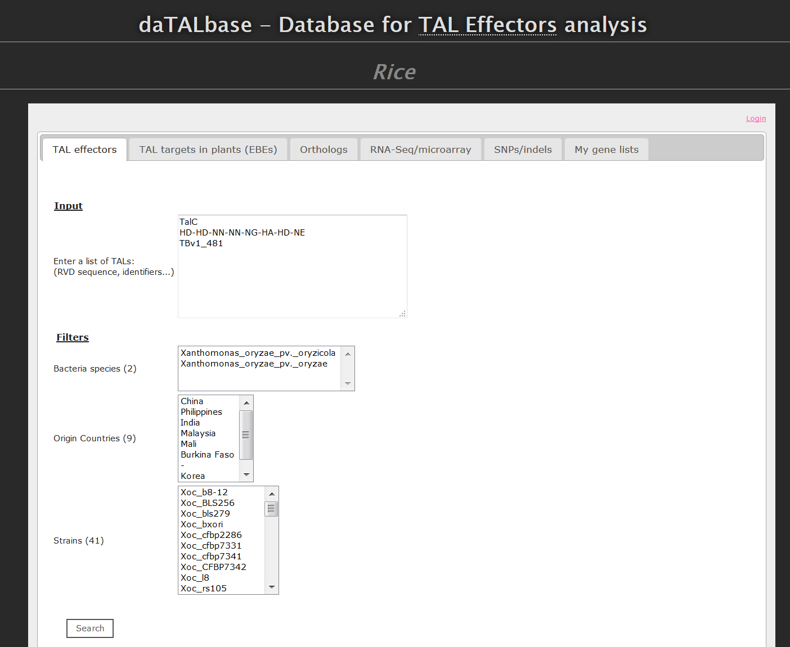

# daTALbase

Rice instance of daTALbase: [http://bioinfo-web.mpl.ird.fr/cgi-bin2/datalbase/index.cgi](http://bioinfo-web.mpl.ird.fr/cgi-bin2/datalbase/index.cgi)

## table of contents

- [Introduction](#introduction)
- [Installation](#installation)

## Introduction

daTALbase is a curated relational database that integrates TALE-related data including:
- bacterial TALE sequences
- plant promoter sequences
- predicted TALE binding sites
- transcriptomic data of host plants in response to TALE-harboring bacteria
- and other associated data. 

The database can be explored to uncover candidate new susceptibility genes, as well as to study variation in TALE repertories and their corresponding targets.

<p align="center">
  
  <br/>
  <i>Screenshot of daTALbase instance of Rice.</i>
</p>

## Installation

1- Git clone

```
git clone https://github.com/SouthGreenPlatform/daTALbase.git
```

2- Create and populate your database


```
mysql>\. daTALbase_schema.sql
```

Using the templates_files as examples, you will be able to populate the database as follows:

```
mysql>LOAD DATA LOCAL INFILE 'PATH_TO_FILES/bacteria.txt' INTO TABLE bacteria;
```

3- Copy directories into dedicated HTML and CGI directories

```
mkdir <DATALBASE_HTML_DIR>
cd <DATALBASE_PATH>/html
cp * <DATALBASE_HTML_DIR>
```

```
mkdir <DATALBASE_CGI_BIN_DIR>
cd <DATALBASE_PATH>/cgi-bin
cp * <DATALBASE_CGI_BIN_DIR>
```

4- Edit the Configuration file and javascript

```
cd <DATALBASE_CGI_BIN_DIR>/Config
vi Configuration.pm
```

Edit the variable "url" (which is called several times) in javascript file

```
cd <DATALBASE_HTML_DIR>/javascript
vi functions.js
```

5- Access to your database


